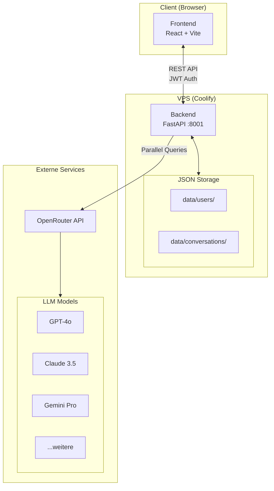
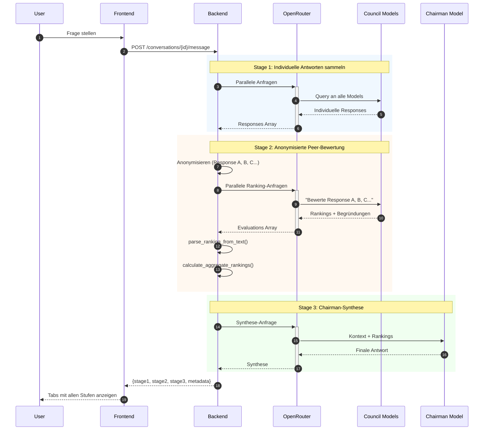
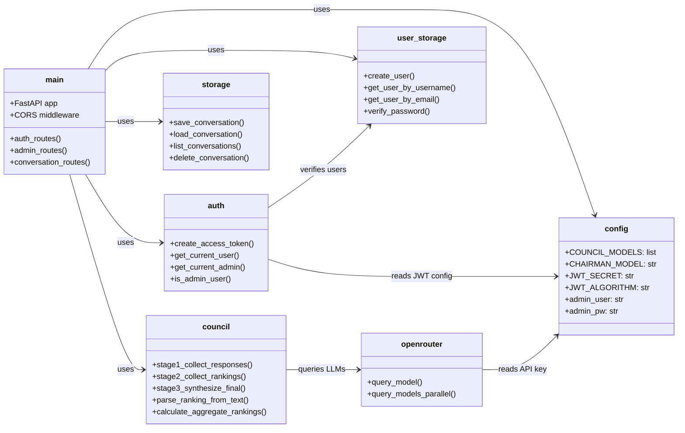
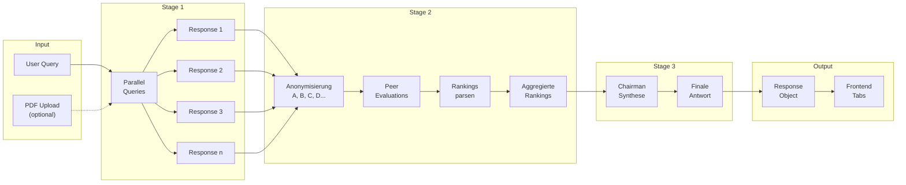
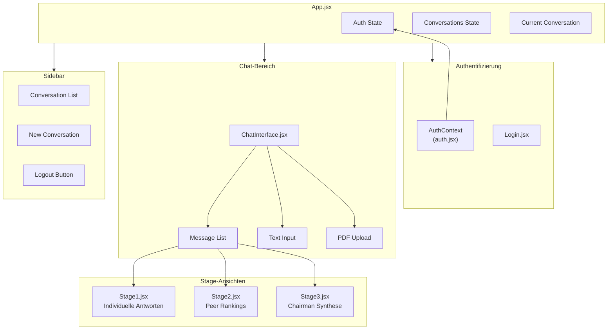
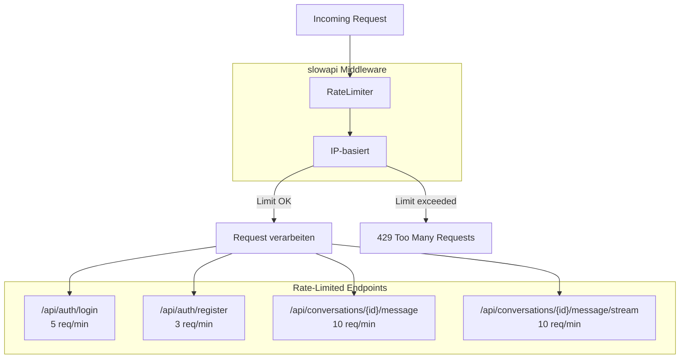
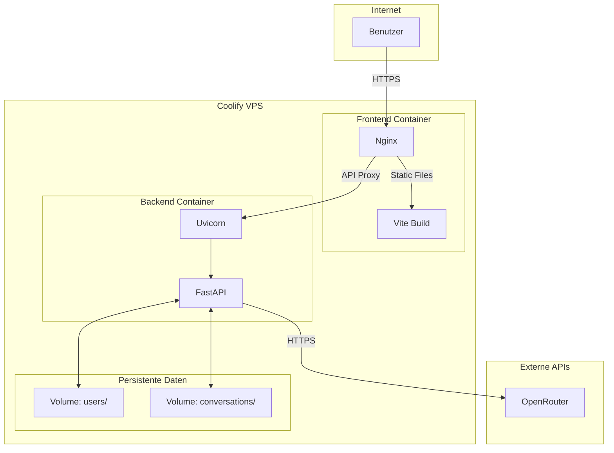

# XQT5AIs - Architekturdiagramme

## 1. System-Architektur

## 2. 3-Stufen-Deliberation-Prozess

## 3. Authentifizierungs-Flow

```mermaid
flowchart TD
    subgraph Registration["Registrierung"]
        R1["/api/auth/register"] --> R2{"Input<br/>Validation"}
        R2 -->|"Invalid"| R3["400 Error"]
        R2 -->|"Valid"| R4["Bcrypt Hash"]
        R4 --> R5["User speichern<br/>(UUID generieren)"]
        R5 --> R6["JWT Token erstellen"]
        R6 --> R7["Token zurückgeben"]
    end

    subgraph Login["Login"]
        L1["/api/auth/login"] --> L2{"Rate Limit<br/>5/min"}
        L2 -->|"Exceeded"| L3["429 Too Many<br/>Requests"]
        L2 -->|"OK"| L4["User laden"]
        L4 --> L5{"Bcrypt<br/>verify"}
        L5 -->|"Invalid"| L6["401 Unauthorized"]
        L5 -->|"Valid"| L7["JWT Token erstellen"]
        L7 --> L8["Token zurückgeben"]
    end

    subgraph Protected["Geschützte Routen"]
        P1["Request mit<br/>Bearer Token"] --> P2["get_current_user()"]
        P2 --> P3{"Token<br/>valid?"}
        P3 -->|"No"| P4["401 Unauthorized"]
        P3 -->|"Yes"| P5{"Admin<br/>Route?"}
        P5 -->|"Yes"| P6["is_admin_user()"]
        P5 -->|"No"| P7["Request verarbeiten"]
        P6 -->|"Not Admin"| P8["403 Forbidden"]
        P6 -->|"Admin"| P7
    end
```

## 4. Backend-Modulstruktur

## 5. Datenfluss-Übersicht

## 6. Frontend-Komponenten

## 7. Rate-Limiting-Übersicht

## 8. Deployment-Architektur

